# 마법한자탐험대

> 초등학생이 판타지 RPG를 플레이하면, 그 플레이 자체가 한자 학습이 되는 웹 게임.

**▶ 지금 해보기 — https://magichanjaadventure.pages.dev**

한자는 "게임의 소재"가 아니라 게임의 메커니즘 그 자체다.
글자를 파내고 획을 그어서 배우고, 조각을 붙여 새 글자를 만들어 봉인을 깨고,
배운 글자끼리 붙여 낱말을 만든다. 도감을 채우면 마법서가 완성된다.

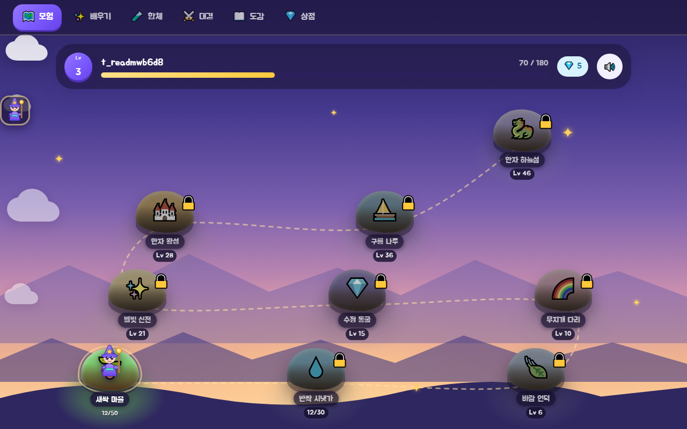

---

## 아이가 하는 일

### 1. 글자를 손으로 찾아낸다

흙에 묻힌 글자를 문질러 파낸다. 획순 데이터가 있는 글자는 **쓰는 순서를 먼저 보여 주고**,
그 다음 아이가 금색 통로를 따라 한 획씩 긋는다.

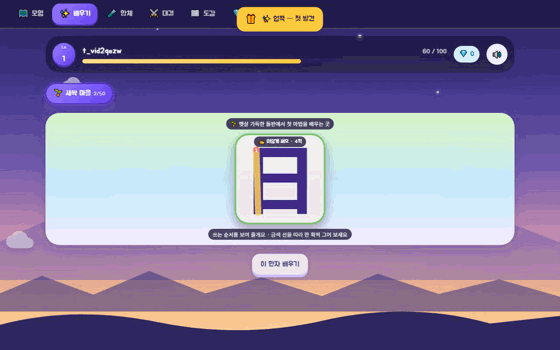

> **실제 플레이 영상.** Playwright 가 화면을 눌러 가며 녹화한 것이다 — 시범이 돌고,
> 아이가 금색 통로를 따라 긋고, 다 그으면 뜻·음이 나온다. (`npm run video:play`)

| 시범 — "이렇게 써요"                         | 아이 차례                                  |
| -------------------------------------------- | ------------------------------------------ |
| 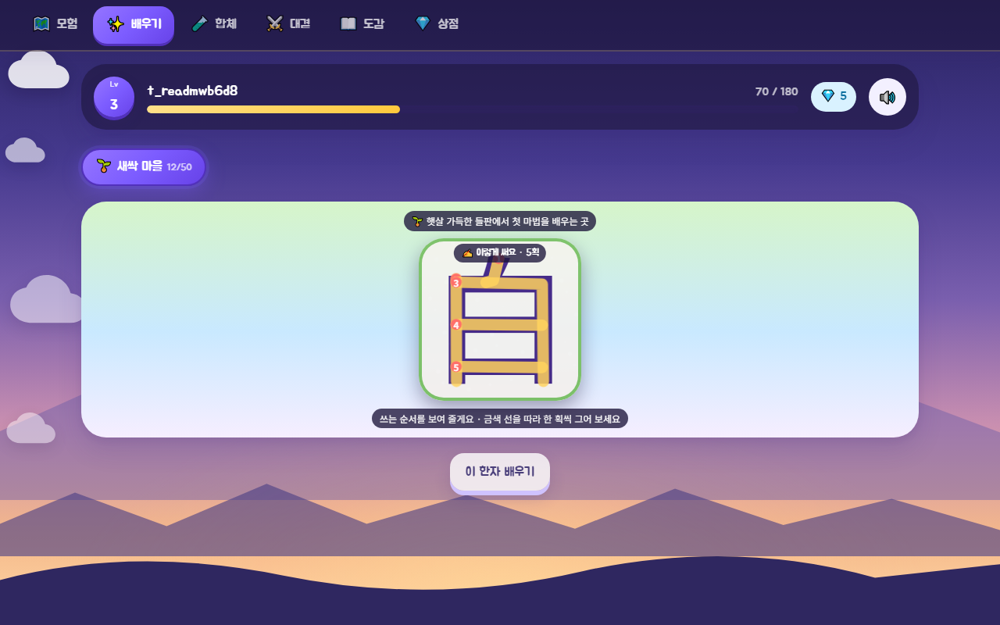 | 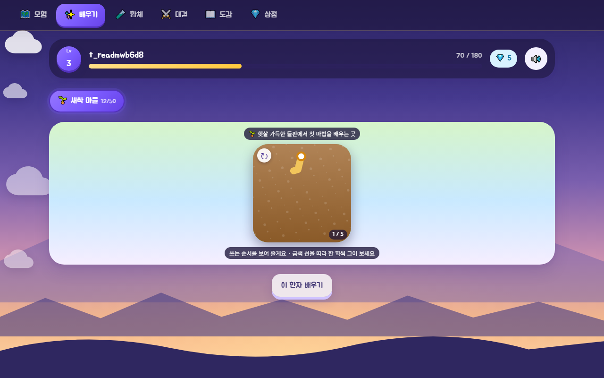 |

- 빗나가도 **벌이 없다.** 흙먼지만 튀고 흙은 그대로다
- 두 번 빗나가면 유령 손가락이 한 번 그어 보이고, 네 번이면 대신 그어 주고 넘어간다
- 왼쪽 위 ↻ 로 언제든 시범을 다시 본다
- 다 쓰고 나면 그때 뜻·음·이야기가 **보상으로** 나온다

### 2. 조각을 붙여 새 글자를 만든다

`日 + 月 = 明`. 대결에서는 봉인된 글자를 조각으로 만들어 깨고, 합체 공방에서는 자유롭게 조합한다.

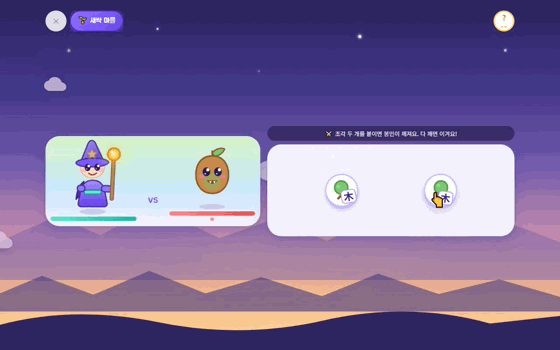

봉인은 **그 마을에서 배운 글자**를 반드시 하나 포함한다. 마을마다 다른 보스, 다른 봉인이 나온다.

### 3. 배운 글자끼리 붙여 낱말을 만든다

조합으로는 영영 만들 수 없는 글자가 있다(`室` `場` 같은 것들). 그래서 두 번째 축이 있다 —
배운 글자 두 개를 붙여 **낱말**을 만든다. 815개 낱말이 1000자 중 955자를 덮는다.

### 4. 도감을 채운다

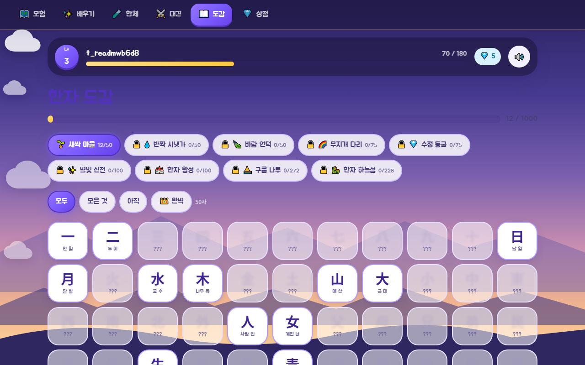

| 첫 화면                           | 다 쓰면 나오는 보상                        |
| --------------------------------- | ------------------------------------------ |
| 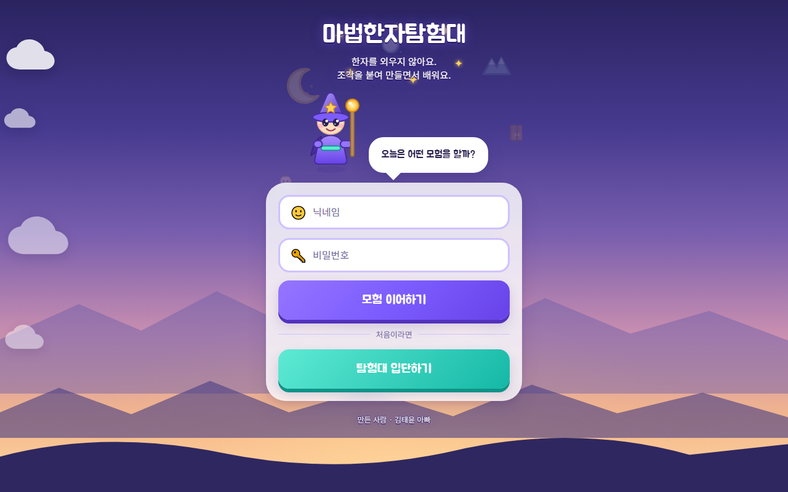 | 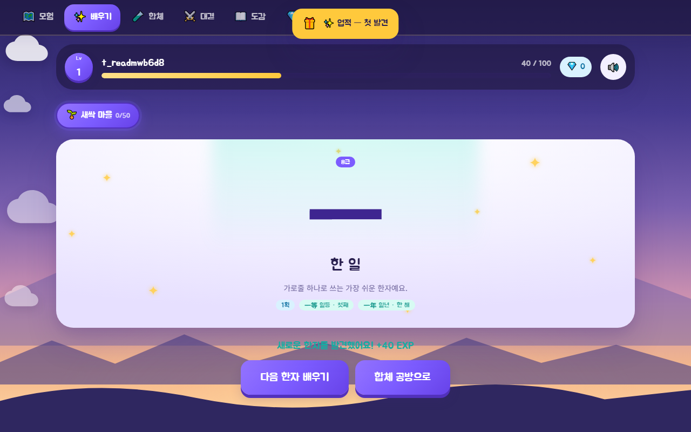 |

---

## 함께 갈 친구를 고른다

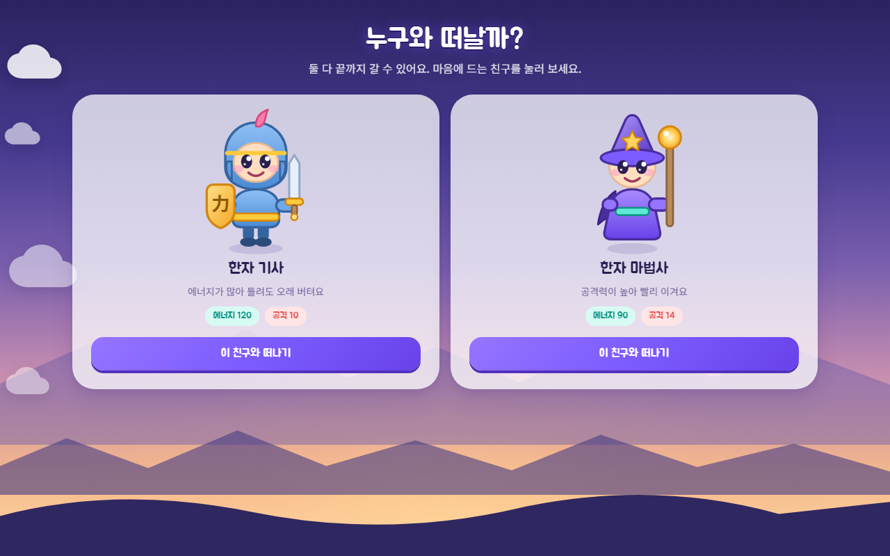

**어떤 선택도 "잘못된 선택"이 되면 안 된다.** 비싼 캐릭터가 무조건 강한 게 아니라
**플레이 리듬이 다르다.** 에너지가 많으면 틀려도 버티고, 공격이 세면 잘 맞힐 때 빨리 끝난다.
그래서 총합(에너지÷10 + 공격)을 **전부 22 근처**로 맞춰 두었다.

|     | 이름        | 에너지 | 공격 | 값     | 어떤 아이에게                      |
| --- | ----------- | ------ | ---- | ------ | ---------------------------------- |
| 🛡️  | 한자 기사   | 120    | 10   | 무료   | 틀려도 오래 버텨요                 |
| 🧙  | 한자 마법사 | 90     | 14   | 무료   | 잘 맞히면 순식간에 끝나요          |
| 🏹  | 한자 궁수   | 105    | 12   | 💎 50  | 균형이 좋아 어디서나 잘 싸워요     |
| 🧘  | 한자 도사   | 140    | 9    | 💎 120 | 실수에 아주 너그러워요             |
| 🦊  | 한자 여우   | 80     | 16   | 💎 200 | 공격이 가장 세지만 에너지는 적어요 |
| 📜  | 한자 천재   | 130    | 13   | 💎 300 | 에너지도 공격도 고루 뛰어나요      |

> 화면에는 "HP" 대신 **"에너지"** 라고 쓴다 — 2학년은 HP 를 모른다.

### 전직 — 레벨 10마다 칭호가 바뀐다

`씩씩한 → 빛나는 → 날쌘 → 굳센 → 늠름한 → 눈부신 → 전설의`

**48개 이름을 짓지 않았다.** 수식어 8개 × 직업 6종이면 조합으로 48가지가 나온다.
칭호는 DB 에 저장하지 않고 **레벨에서 유도한다** — 그래서 상점에서 캐릭터를 바꿔도
단계가 자동으로 보존되고, "구매하면 초기화되나?" 라는 어느 쪽을 골라도 버그인 질문이
아예 생기지 않는다.

## 상점 — 보석으로 사는 것

| 캐릭터                                           | 장비                                      |
| ------------------------------------------------ | ----------------------------------------- |
| 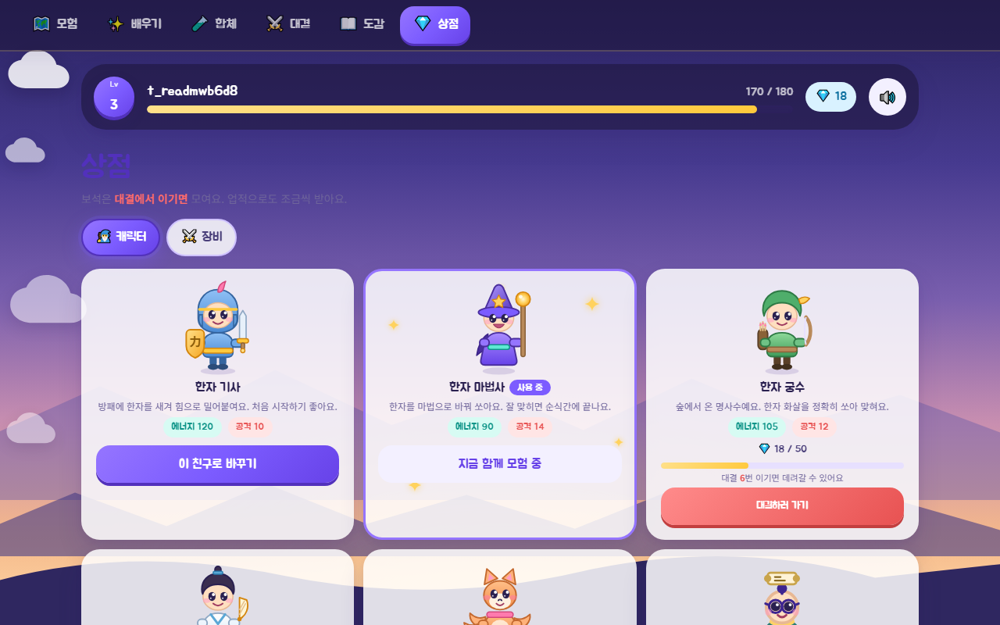 | 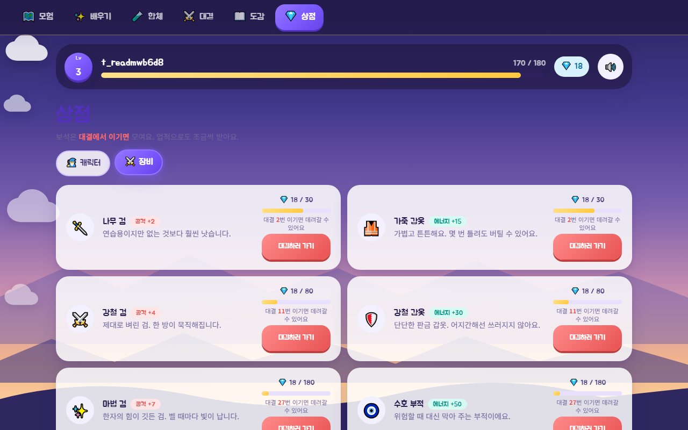 |

**장비는 한 번 사면 계속 적용된다(누적).** 장착/해제 개념을 두지 않았다 —
저학년에게 "무기 슬롯 / 방어구 슬롯"은 규칙이 하나 더 늘어나는 것이고,
모은 것이 그대로 세짐으로 이어져야 "모으는 재미"가 성립한다.

|     | 장비      | 효과       | 값     |
| --- | --------- | ---------- | ------ |
| 🗡️  | 나무 검   | 공격 +2    | 💎 30  |
| 🦺  | 가죽 갑옷 | 에너지 +15 | 💎 30  |
| ⚔️  | 강철 검   | 공격 +4    | 💎 80  |
| 🛡️  | 강철 갑옷 | 에너지 +30 | 💎 80  |
| ✨  | 마법 검   | 공격 +7    | 💎 180 |
| 🧿  | 수호 부적 | 에너지 +50 | 💎 180 |

전부 모으면 공격 +13 · 에너지 +95. 기사 기준 공격 23 / 에너지 215 로,
마지막 지역 보스를 여유 있게 잡을 수 있는 수준이다.

**보석이 나오는 곳은 대결 승리 하나뿐이다** (5 + 별 0~3). 나머지는 전부 1회성 업적이다.
한때 상점 화면이 "퀴즈 · 대결 · 업적으로 모을 수 있어요" 라고 적어 두고 있었는데,
아이가 그 말을 믿고 복습만 반복하면 영원히 아무것도 못 산다.

---

## 내용 규모

|             |                                          |
| ----------- | ---------------------------------------- |
| 한자        | **1000자** · 9개 마을(급수별)            |
| 획순 데이터 | **99자** (새싹 마을 49 + 반짝 시냇가 50) |
| 낱말        | **815개** — 1000자 중 955자를 덮는다     |
| 캐릭터      | **6직업** · 레벨 10마다 전직             |

획순이 없는 글자는 지금까지처럼 **흙을 파낸다.** 그건 결함이 아니라 설계다 —
통로가 글자와 어긋나면 아이가 글자 없는 자리를 문지르게 된다.
**틀린 통로는 없느니만 못하다.**

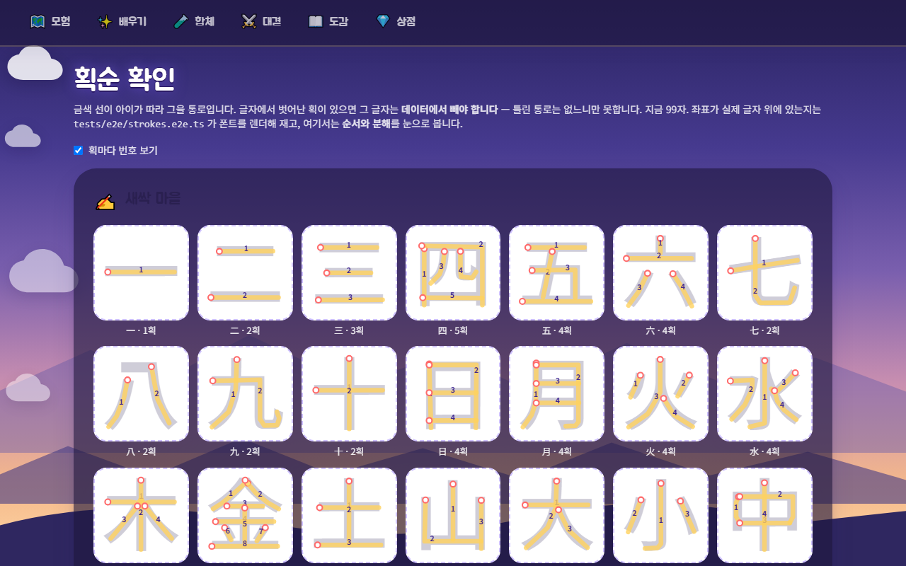

> `/styleguide/strokes` — 실제 글자 위에 통로를 겹쳐 그린다. 벗어난 획이 있으면 바로 보인다.

---

## 빠른 시작

```bash
npm install
cp .env.example .dev.vars      # 로컬 시크릿/변수 (git 에 올라가지 않음)
npm run db:migrate             # 로컬 D1 준비
npm run dev
```

세 화면 크기를 모두 지원한다: **1280×800 · 1024×768 · 390×844**.

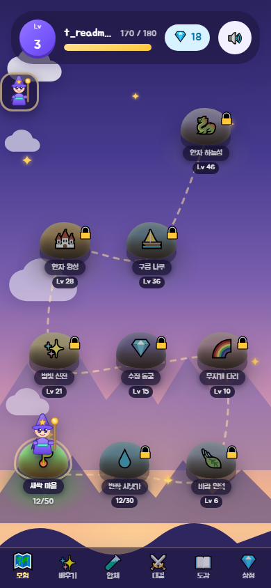

## 명령

| 명령                        | 설명                                                     |
| --------------------------- | -------------------------------------------------------- |
| `npm run dev`               | 개발 서버 (로컬 D1/R2 바인딩 포함)                       |
| `npm run check`             | Cloudflare 타입 생성 검증 + TypeScript 검사              |
| `npm run lint` / `format`   | Prettier + ESLint                                        |
| `npm run test:unit`         | Vitest — 순수 로직 / 데이터 무결성                       |
| `npm run test:e2e`          | Playwright — desktop · tablet · mobile                   |
| **`npm run verify`**        | **시크릿스캔 → 타입 → lint → 단위 → 빌드** (커밋 게이트) |
| `npm run scan:secrets`      | 시크릿 / 개인정보 패턴 검사                              |
| `npm run db:migrate`        | 로컬 D1 마이그레이션 적용                                |
| `npm run db:reset`          | 로컬 D1 초기화 (로컬 전용, 원격은 거부)                  |
| `npm run db:query`          | 로컬 D1 에 SQL 실행                                      |
| `npm run build` / `preview` | 프로덕션 빌드 / 실제 workerd 런타임으로 실행             |
| `npm run deploy:pages`      | **운영 마이그레이션 → 빌드 → Pages 배포**                |
| `npm run stroke:atlas`      | 획순 좌표를 만들고 재는 자 (아래 참고)                   |
| `npm run shots:readme`      | 이 README 의 화면을 다시 찍는다                          |
| `npm run video:play`        | 플레이 영상을 녹화한다 (webm)                            |
| `npm run video:gif`         | 그 영상을 README 용 GIF 로 바꾼다                        |

`npm run verify` 통과 = 커밋 가능 상태.

### 배포

`npm run deploy:pages` 는 **표를 코드보다 먼저 올린다.**
반대로 하면 새 코드가 뜨는 순간 표가 없어서 아이에게 "문제가 생겼어요" 한 줄만 보인다.
실제로 그 사고가 났었고(`user_words`), 그래서 배포 스크립트가 그 순서를 강제한다.

---

## 이 저장소가 지키는 것

비싸게 배운 규칙들이다. 코드 주석이 **왜 그런지**를 각 자리에서 설명한다.

**렌더링에 `Math.random()` / `Date.now()` 를 쓰지 않는다.**
서버와 화면이 어긋나 하이드레이션이 깨진다. 흙 알갱이도 글자 코드포인트를 씨앗으로 흩는다.

**Playwright 가 봐야 하는 연출은 GSAP 이 아니라 Web Animations API 로 만든다.**
GSAP 트윈은 `document.getAnimations()` 에도, `animations:'disabled'` 에도 잡히지 않는다.

**`prefers-reduced-motion` 은 애니메이션을 끝 프레임에 앉힌다.**
그래서 끝 프레임이 중립이어야 한다. 개별 `translate`/`scale`/`rotate` 는 `transform` 과 합성되므로,
`transform` 으로 자리를 잡는 요소에는 개별 속성을 쓴다.

**보상과 판정은 언제나 서버가 다시 계산한다.**
봉인 개수처럼 클라이언트가 보내는 값은 믿지 않는다.

**획순 좌표는 손으로 찍지 않는다.**
어떤 획이 몇 번째인지는 사람이 정하고, **그 획이 어디 있는지는 글꼴에서 읽는다.**
`npm run stroke:atlas` 가 대충 그은 선을 실제 잉크 능선으로 끌어다 붙이고,
빈 곳을 건너지 않는지·획을 빠뜨리지 않았는지 잰다.

---

## 이 문서의 그림은 어떻게 만들어졌나

전부 **Playwright 가 실제로 플레이하면서** 남긴 것이다. 손으로 찍은 그림이 하나도 없으므로
화면이 바뀌면 명령 한 줄로 전부 갱신된다. 계정은 언제나 가짜 데이터(`test_*`)를 쓴다.

```bash
npm run shots:readme    # 정지 화면 → docs/screens/*.png
npm run video:play      # 플레이 녹화 → test-results/**/video.webm
npm run video:gif -- "find:획순으로" docs/screens/play-learn.gif --fps 7 --width 560 --from 7.4 --to 18.6
```

**왜 영상이 아니라 GIF 인가.** GitHub 은 README 안의 `<video>` 태그를 **지운다**
(마크다운 API 로 확인했다 — `<video>` 는 빈 `<p>` 가 되고 `` 는 남는다).
저장소에 올린 영상 파일은 인라인 재생이 되지 않으므로, 움직이는 그림은 GIF 뿐이다.

만드는 길이 곧지 않다. 시스템에 ffmpeg 이 없지만 **Playwright 가 자체 ffmpeg 을 번들**한다 —
다만 그 빌드는 VP8 디코드와 PNG 인코드만 되고 GIF 먹서도 `fps` 필터도 없다.
그래서 프레임만 PNG 로 뽑고(`-r`/`-s`), GIF 로 묶는 것은 `gifenc`(순수 JS)가 한다.
PNG 를 픽셀로 푸는 것은 **Node 가 직접 한다** — 처음엔 Chromium 에게 시켰는데 픽셀을
페이지 밖으로 꺼내는 데만 100장에 10분이 넘게 걸렸다. PNG 는 zlib 만 있으면 풀리고
zlib 은 Node 에 들어 있다. 지금은 4.5초다.

---

## 테스트

|                  |                                                   |
| ---------------- | ------------------------------------------------- |
| 단위 (Vitest)    | 19개 파일 · 242개 — 순수 로직과 **데이터 무결성** |
| E2E (Playwright) | 세 뷰포트 — desktop 55 / tablet 53 / mobile 53    |

E2E 는 픽셀 비교를 하지 않는다. 대신 **레이아웃 자동 검사기**(`tests/helpers/layout.ts`)가
매 화면에서 가로 넘침·글자 잘림·48px 미만 터치 타깃·화면 밖 요소·버튼 겹침·낮은 대비·
중복 DOM id 를 잡는다. 의도한 예외는 `data-allow-clip` / `data-allow-small` /
`data-allow-offscreen` / `data-allow-overlap` 로 명시한다.

몇 가지 검사는 **기계만 볼 수 있는 것**을 못 박는다:

- `strokes.e2e.ts` — 실제 폰트를 렌더해 99자의 통로가 글자 위에 있는지 픽셀로 잰다
- `schema.spec.ts` — 코드가 참조하는 모든 표가 마이그레이션에 있는지 확인한다
- `hanja.spec.ts` — 시드의 획수·급수·조합 관계가 서로 어긋나지 않는지 본다

E2E 를 돌리면 주요 화면 스크린샷이 `screenshots/<viewport>/` 에 모인다(커밋하지 않는다).
디자인 토큰과 컴포넌트는 `/styleguide` 에서 한 화면으로 볼 수 있다.

---

## 기술 스택

SvelteKit 2 (Svelte 5 runes) · TypeScript · Tailwind CSS 4 · GSAP · PixiJS 8
Cloudflare Pages · Workers · D1 · R2 · Playwright · Vitest

## 문서

| 문서                                                  | 내용                                      |
| ----------------------------------------------------- | ----------------------------------------- |
| [00-ARCHITECTURE.md](docs/00-ARCHITECTURE.md)         | 아키텍처 결정, 스택 버전, 인증, 성능 예산 |
| [01-DATABASE.md](docs/01-DATABASE.md)                 | D1 스키마, 게임 수치 규칙                 |
| [02-DESIGN-SYSTEM.md](docs/02-DESIGN-SYSTEM.md)       | 색·타이포·모션 토큰, 캐릭터 아트 규칙     |
| [03-TEST-STRATEGY.md](docs/03-TEST-STRATEGY.md)       | 테스트 harness, 레이아웃 자동 검수        |
| [04-CONTENT-PLAN.md](docs/04-CONTENT-PLAN.md)         | 한자 선정 근거, 지역·몬스터·업적          |
| [05-PHASE-PLAN.md](docs/05-PHASE-PLAN.md)             | 개발 계획                                 |
| [06-ASSETS-LICENSE.md](docs/06-ASSETS-LICENSE.md)     | 에셋 라이선스 대장                        |
| [07-FUSION-CORE-LOOP.md](docs/07-FUSION-CORE-LOOP.md) | 합체 코어 루프 설계                       |

## 개인정보 원칙

- 수집 정보는 **닉네임과 비밀번호뿐**이다. 이메일·전화·실명·생년월일을 받지 않는다.
- IP, User-Agent 등 식별 가능한 값을 저장하지 않는다.
- 테스트는 전부 가짜 데이터(`test_*`)를 쓴다. 이 README 의 화면도 그 계정으로 찍었다.
- 시크릿은 `.dev.vars` / `wrangler secret` 으로만 다루며 저장소에 넣지 않는다.
- 에셋은 **상업적 사용이 확인된 라이선스**만 쓴다. 불명확하면 쓰지 않는다.
  (폰트는 Jua / Noto Sans KR — 둘 다 SIL OFL, `static/fonts/OFL.txt`)

---

<sub>만든 사람 · 김태윤 아빠</sub>
